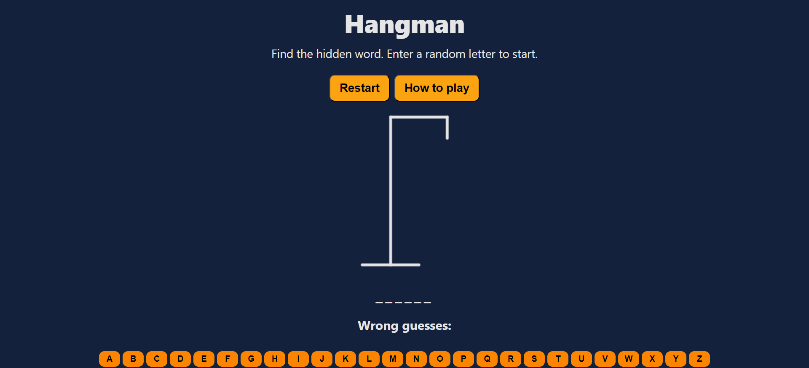

# React Weather App

## Description

This is a hangman game I made using ReactJS when I first started learning React. The game is simple, there is a hidden word and a user must guess any letter of the alphabet to find out if that letter is in the hidden word. Users can get 6 guesses incorrect before the game ends.

### Deployment

This app has been deployed using Vercel and can be found at this [link](https://hangman-gamma-plum.vercel.app/)

### Screenshot

This is a screenshot of the application after clicking the "start game" button 
